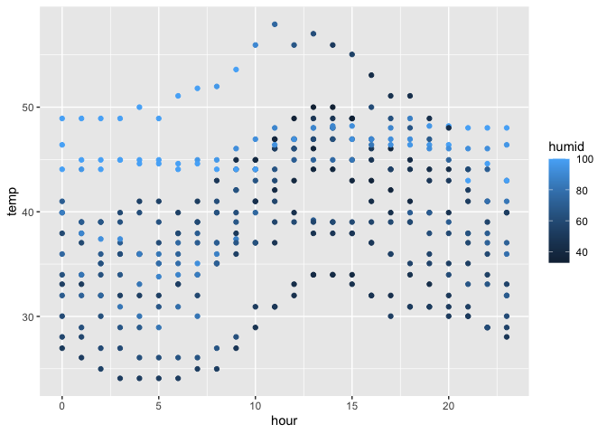

p8105_hw1_nl2835
================
Nancy Le
09-21-2023

Problem \#1

``` r
library(moderndive)
data("early_january_weather")
```

The “early_january_weather dataset describes hourly meteorological data
for LGA, JFK, and EWR for the month of January 2013. This is a subset of
the weather data frame from nycflights13.

The format of this dataset is a dataframe of `358` rows and `15` columns
representing hourly measurements and 15 variables. Some important
variables are origin (meaning the weather station), year, month, day,
hour, temp, and dewp.

``` r
mean_temp <- mean(early_january_weather[["temp"]])
```

The mean temperature is `39.5821229`.

``` r
library(ggplot2)

ggplot(data = early_january_weather, aes(x = hour, y = temp, color = humid)) + geom_point()
```

<!-- -->

    ## Saving 7 x 5 in image

Problem \#2

    ## ── Attaching core tidyverse packages ──────────────────────── tidyverse 2.0.0 ──
    ## ✔ dplyr     1.1.3     ✔ readr     2.1.4
    ## ✔ forcats   1.0.0     ✔ stringr   1.5.0
    ## ✔ lubridate 1.9.2     ✔ tibble    3.2.1
    ## ✔ purrr     1.0.2     ✔ tidyr     1.3.0
    ## ── Conflicts ────────────────────────────────────────── tidyverse_conflicts() ──
    ## ✖ dplyr::filter() masks stats::filter()
    ## ✖ dplyr::lag()    masks stats::lag()
    ## ℹ Use the conflicted package (<http://conflicted.r-lib.org/>) to force all conflicts to become errors

``` r
set.seed(1234)

hw_df = #create example data frame
  tibble( 
    random_sample = rnorm(10),
    vec_char = c("Hi", "I", "am", "making", "a", "character", "vector", "of", "length", "ten"),
    vec_logical = random_sample > 0, 
    vec_factor = factor(c("single", "married", "married", "single", "single", "divorced", "divorced", "single", "married", "married"))
  )
```

This is a data frame comprised of: \* a random sample of size 10 from a
standard normal distribution \* a logical vector indicating whether
elements from the random sample are greater than 0 \* a character vector
of length 10 \* a factor vector of length 10, with 3 different factor
“levels” of “single”, “married”, and “divorced”

``` r
mean(pull, hw_df, vec_char)
```

    ## Warning in mean.default(pull, hw_df, vec_char): argument is not numeric or
    ## logical: returning NA

    ## [1] NA

``` r
mean(pull, hw_df, vec_logical)
```

    ## Warning in mean.default(pull, hw_df, vec_logical): argument is not numeric or
    ## logical: returning NA

    ## [1] NA

``` r
mean(pull, hw_df, vec_factor)
```

    ## Warning in mean.default(pull, hw_df, vec_factor): argument is not numeric or
    ## logical: returning NA

    ## [1] NA

The arguments to get the means of the logical, character, and factor
vector are not numeric or logical, and returns NA.
